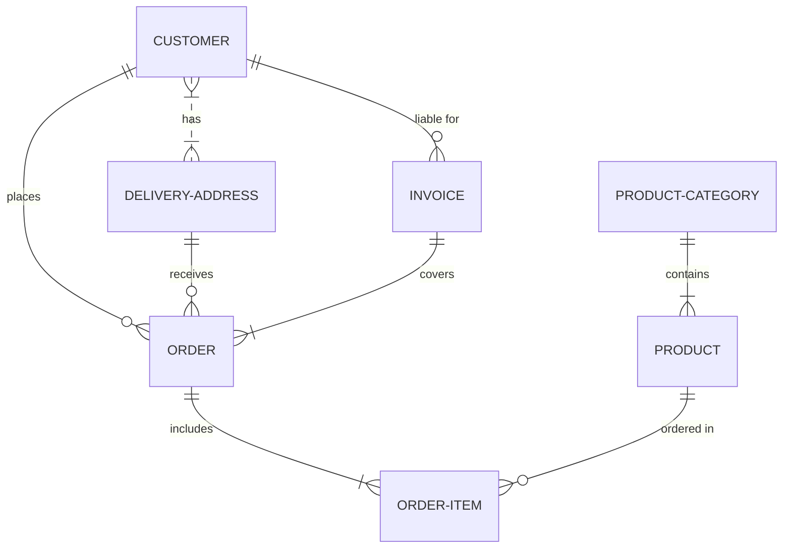
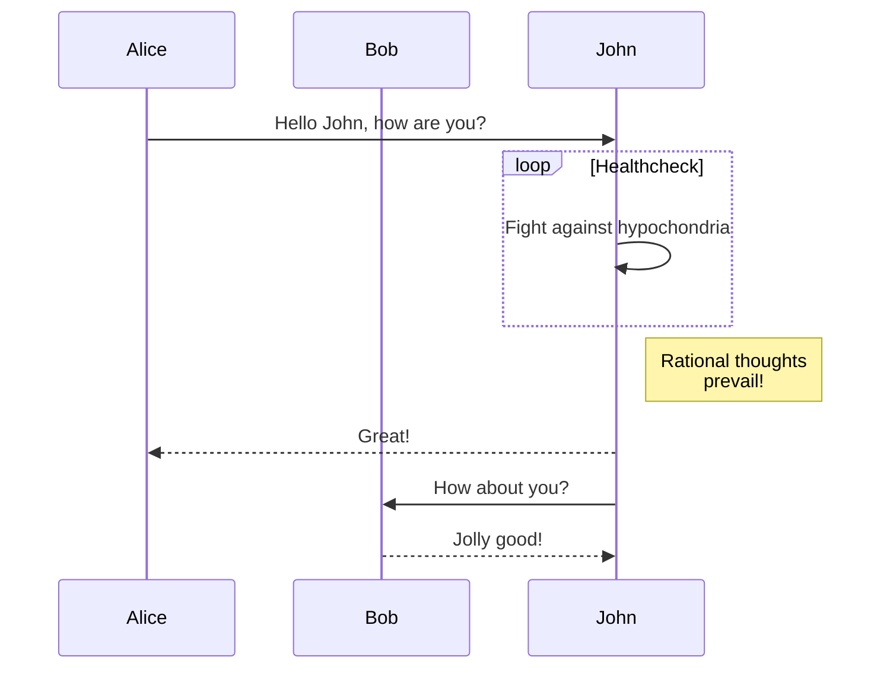
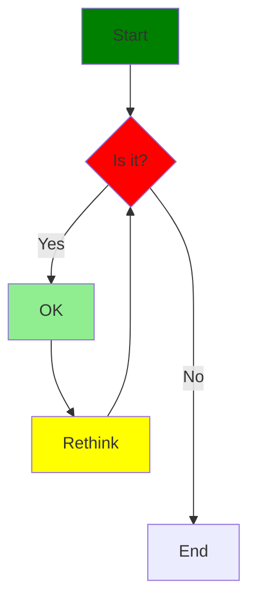
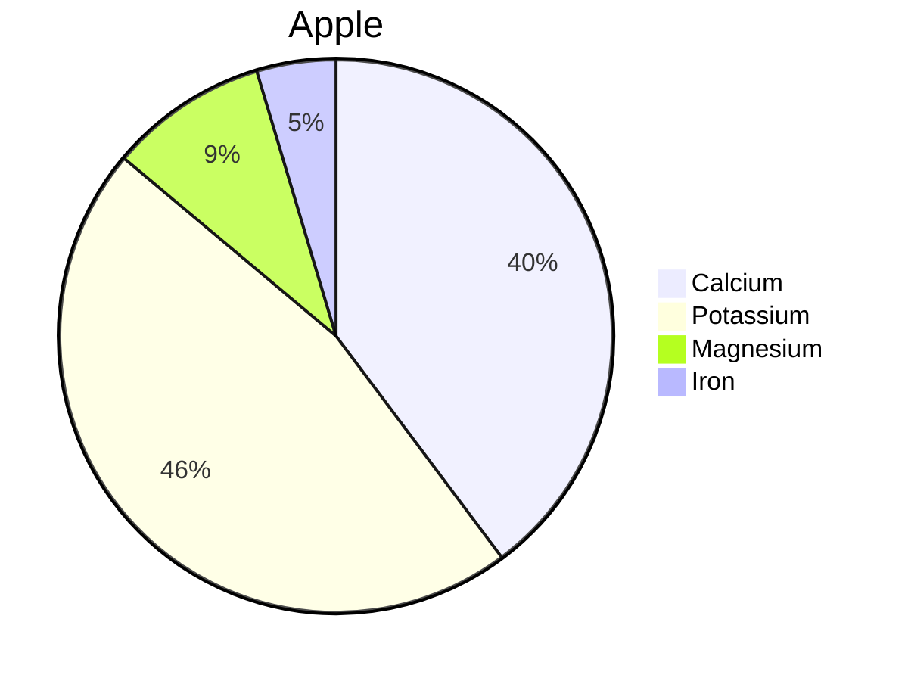

```mermaid
erDiagram
          CUSTOMER }|..|{ DELIVERY-ADDRESS : has
          CUSTOMER ||--o{ ORDER : places
          CUSTOMER ||--o{ INVOICE : "liable for"
          DELIVERY-ADDRESS ||--o{ ORDER : receives
          INVOICE ||--|{ ORDER : covers
          ORDER ||--|{ ORDER-ITEM : includes
          PRODUCT-CATEGORY ||--|{ PRODUCT : contains
          PRODUCT ||--o{ ORDER-ITEM : "ordered in"
            
```

```mermaid
sequenceDiagram
    participant Alice
    participant Bob
    Alice->>John: Hello John, how are you?
    loop Healthcheck
        John->>John: Fight against hypochondria
    end
    Note right of John: Rational thoughts <br/>prevail!
    John-->>Alice: Great!
    John->>Bob: How about you?
    Bob-->>John: Jolly good!
            
```

```mermaid
flowchart TD
    A[Start] --> B{Is it?}
    B -- Yes --> C[OK]
    C --> D[Rethink]
    D --> B
    B -- No ----> E[End]
    style A fill:green
    style B fill:red
    style C fill:lightgreen
    style D fill:yellow   
```    

```mermaid
pie
    title Apple
    "Calcium" : 42.96
    "Potassium" : 50.05
    "Magnesium" : 10.01
    "Iron" :  5
```    
